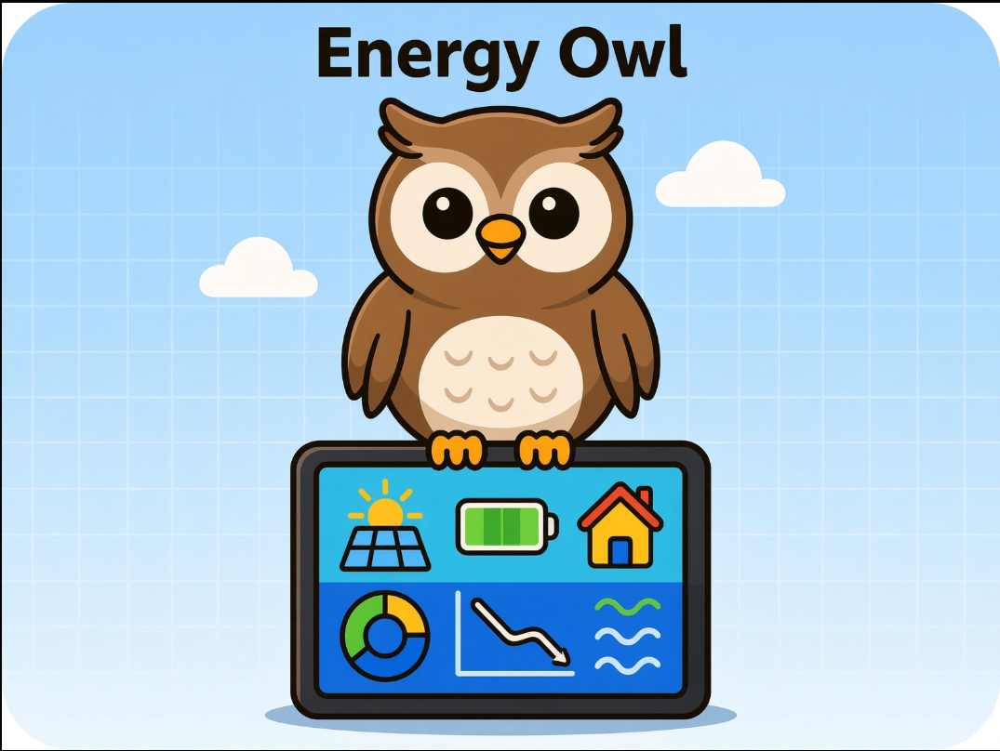

# Shared Energy Telemetry Device



Firmware voor een ESP32-S3-BOX-3 die toont hoeveel energie de energiegemeenschap op dit
moment over heeft. Het apparaat haalt de meetwaarden op bij de Energyboxx-API en toont de
uitkomst op zijn scherm.

Dit apparaat hoort bij de Energiegemeenschap Wilhelminaweg in Wageningen. Dat is een groep
huishoudens die overtollige zonne-energie deelt. Wat dat project wil bereiken en hoe, staat
in [docs/energiegemeenschap-wilhelminaweg.md](docs/energiegemeenschap-wilhelminaweg.md).

De gebruiker stelt de wifi- en API-gegevens in via een webportaal op het apparaat zelf. De
gegevens staan dus niet in de firmware.

## Wat het apparaat doet

Het apparaat vraagt elke minuut de telemetrie op. Het stuurt het scherm aan op het veld
`community_power_result_kw`.

| Uitkomst | Op het scherm | Kleur |
| --- | --- | --- |
| Meer dan `+0,05 kW` | Energie over | Groen |
| Minder dan `-0,05 kW` | Energie inkopen | Geel |
| Tussen `-0,05` en `+0,05 kW` | In balans | Donkergroen |
| Geen actuele meting | Geen gegevens | Grijs |

Het scherm kent nog vier toestanden die over het apparaat zelf gaan: **Instellen** tijdens
provisioning, **Verbinden** terwijl het een netwerk zoekt, **Sleutels nodig** als er geen
API-gegevens zijn, en **Bijwerken** terwijl het nieuwe firmware ophaalt.

Het apparaat houdt zichzelf bij. Het haalt nieuwe firmware op bij de maker en installeert die
zonder iets te vragen. Zie [Bijwerken](#bijwerken).

Bij het opstarten toont het apparaat minstens een seconde de Energy Owl, met het
versienummer van de firmware rechtsonder.

## Vaste termen

| Term | Betekenis |
| --- | --- |
| Provisioning | Het instellen van de wifi- en API-gegevens via het webportaal |
| Portaal | De webpagina's die het apparaat zelf aanbiedt tijdens provisioning |
| Toestand | Wat het apparaat op dit moment over zichzelf of de gemeenschap toont |
| Statusscherm | Het beeld met wifi, sleutels, laatste meting en portaal |
| Voorbeeld | Een toestand waar iemand naartoe gebladerd is, en die dus niet gemeten is |
| Telemetrie | De meetwaarden die het apparaat bij de Energyboxx-API ophaalt |
| Credentials | De opgeslagen wifi- en API-gegevens |
| Release | Een uitgave van de firmware met een versienummer |
| Proeftijd | De periode waarin nieuwe firmware moet bewijzen dat zij werkt |
| Terugval | Het apparaat start de vorige firmware weer op |

## Hardware

Het apparaat is een **ESP32-S3-BOX-3**, zonder losse onderdelen eromheen.

| Onderdeel | |
| --- | --- |
| Module | ESP32-S3-WROOM-1 |
| Flash | 16 MB |
| PSRAM | 16 MB, octal |
| Scherm | 2,4 inch, 320 × 240, ILI9341 |
| Aanraakscherm | GT911 |
| Knoppen | drie |
| Geluid | luidspreker en twee microfoons, nog niet in gebruik |

De driverlaag komt uit de BSP van Espressif, `espressif/esp-box-3`. Die staat als
afhankelijkheid in `main/idf_component.yml` en brengt LVGL mee.

## Bediening

| Handeling | Werking |
| --- | --- |
| Aanraking op het scherm | begint met bladeren en zet de pijlen erbij |
| Pijl links en rechts | een beeld terug of verder |
| Knop `config` | een beeld terug |
| Knop `mute` | een beeld verder |
| Knop `main` op het paneel | meteen terug naar de telemetrie |

Bladeren gaat door zeven beelden: het statusscherm, de About-pagina, de Energy Owl en de
vier energietoestanden. Na vijftien seconden zonder aanraking volgt het apparaat de telemetrie
weer.

Zonder merkteken is een gebladerd beeld niet van een meting te onderscheiden. Het merkteken
**voorbeeld** linksboven zegt daarom precies één ding: wat u ziet is niet wat het apparaat nu
meet. Alleen beelden die een meting beweren kunnen het dragen.

| Beeld | Merkteken linksboven |
| --- | --- |
| Energie over, Energie inkopen, In balans, Geen gegevens | **voorbeeld**, zolang het niet de actuele toestand is |
| Statusscherm, About-pagina, Energy Owl | nooit — die gaan over het apparaat zelf en kloppen altijd |

Het merkteken volgt de telemetrie. Wie op "Energie over" blijft staan terwijl de gemeenschap
overgaat op inkopen, ziet het merkteken alsnog verschijnen.

### Het statusscherm

Het eerste beeld in de bladerlijst toont wat het apparaat over zichzelf weet:

```text
Wifi      OETELX
          192.168.50.145
Sleutels  goed, nog 119 min
Meting    42 s geleden
Portaal   dicht
```

Onderaan staat de knop **Sleutels invoeren**. Zie "Sleutels opnieuw invoeren".

### De About-pagina

Het tweede beeld noemt de makers en de herkomst, en zegt welke build er draait:

```text
Energy Owl

Paddy, Job en Edwin        [QR]
(c) 2026
Dolphin Solutions
dolphinsolutions.nl
Versie    v0.1.0
Gebouwd   Sep  1 2026
Apparaat  CB8B90
Update    niets te doen

     [ Nu bijwerken ]
```

De QR-code opent
[dolphinsolutions.nl/gestuurde-energie-gemeenschap](https://www.dolphinsolutions.nl/gestuurde-energie-gemeenschap/).

De knop **Nu bijwerken** laat het apparaat meteen bij GitHub kijken of er nieuwe firmware is.
De regel `Update` zegt wat de updater doet. Zie [docs/OTA.md](docs/OTA.md).

Versie en bouwdatum komen uit de firmware zelf, niet uit een constante die iemand moet
bijwerken. Het versienummer komt uit de git-tag. `Apparaat` toont de laatste drie bytes van het MAC-adres: met meerdere
testapparaten in omloop is "welk apparaat is dit?" de eerste vraag bij een storingsmelding,
en dit is hetzelfde nummer dat de router laat zien.

De onderste 60 pixels van elk scherm zijn gereserveerd voor de bladerpijlen, die over elk
beeld kunnen verschijnen. Het tekstblok op deze pagina heeft daarom een vaste hoogte: te
veel tekst wordt zichtbaar afgekapt in plaats van onder een knop te verdwijnen.

## Provisioning

Het apparaat probeert bij het opstarten eerst de opgeslagen credentials. Het start een eigen
accesspoint zodra er geen wifigegevens zijn opgeslagen, of het opgeslagen netwerk niet binnen
30 seconden antwoordt.

Het accesspoint heeft deze gegevens:

```text
SSID: SETD_Provisioning
Wachtwoord: geen
```

Op het scherm staat een **QR-code**. Richt daar een telefooncamera op: de telefoon biedt aan
het netwerk te joinen. Wie liever handmatig zoekt, vindt het netwerk onder de naam hierboven.
Het portaal opent daarna meestal vanzelf; anders is het `http://192.168.4.1`.

Het portaal vraagt twee dingen, in deze volgorde:

1. Kies een wifinetwerk en vul het wachtwoord in.
2. Vul de Energyboxx client ID en client secret in.

Het apparaat slaat gegevens pas op als het ze heeft beproefd. De wifigegevens gaan naar NVS
zodra de verbinding lukt. De API-gegevens gaan naar NVS zodra de tokenaanvraag lukt.

Als de sleutels worden goedgekeurd toont het scherm zes seconden **Klaar, we zijn online**.
Drie seconden later sluit het portaal zichzelf en schakelt het apparaat over naar wifi in
alleen station-modus.

### Ontbrekende sleutels

Werkt de wifi wel maar ontbreken de API-sleutels, dan blijft het apparaat niet wachten. Het
verbindt, toont **Sleutels nodig**, en draait door. Wie langsloopt kan het portaal vanaf het
statusscherm openen.

### Sleutels opnieuw invoeren

Druk op **Sleutels invoeren** op het statusscherm. Het apparaat zet zijn accesspoint aan
terwijl het op zijn eigen netwerk blijft, dus de wifigegevens hoeven niet opnieuw. Omdat er
al een verbinding is, komt de bezoeker meteen op de sleutelpagina uit.

Het portaal sluit zichzelf zodra de sleutels zijn geaccepteerd, of na vijftien minuten
zonder gebruik. Worden de nieuwe sleutels afgekeurd, dan zet het apparaat de vorige terug en
werkt het gewoon door.

## Credentials wissen

Schakel de voeding drie keer binnen tien seconden uit en weer in.

De teller gaat na tien seconden draaien terug naar nul. Alleen een echte in- en
uitschakeling telt mee. Een herstart door een firmwarefout, een watchdog of een
onderspanning telt niet mee, dus een softwarefout kan de credentials niet zelf wissen.

## Gedrag bij storingen

Het apparaat geeft nooit op. Het probeert het opnieuw volgens vaste schema's.

**Wifi weg.** Het apparaat blijft opnieuw verbinden, met een oplopende wachttijd: 0,5 s,
1 s, 2 s, 5 s, 10 s, 30 s, 60 s en daarna elke 5 minuten. Vanaf de stap van tien seconden
toont het scherm **Geen verbinding**. Het schema is de tabel `s_retry_schedule` in
`main/src/wifi_provisioning.c`.

**Wachtwoord fout.** Het netwerk kan een wachtwoord weigeren, en dan helpt opnieuw proberen
niet — alleen een nieuw wachtwoord helpt. Het apparaat herkent dat aan de reden die de router
teruggeeft, toont **Wachtwoord klopt niet** en opent binnen enkele seconden het portaal in
plaats van de hele reeks hierboven af te lopen.

Het blijft het daarnaast elke 5 minuten stil proberen. Een handshake kan namelijk ook op een
slechte verbinding aflopen terwijl het wachtwoord klopt, en een apparaat dat helemaal stopt
komt zonder hulp niet meer terug.

**API onbereikbaar.** Een mislukte token- of telemetrieaanvraag stopt de firmware niet. Het
apparaat toont **Geen gegevens** en probeert het opnieuw. De wachttijd loopt op: 10 s, 20 s,
40 s, 80 s, 160 s en daarna elke 5 minuten. Het schema is de tabel `s_api_retry_delay_ms` in
`main/main.c`.

**Spreiding.** Elke wachttijd krijgt tot een vijfde extra, ook de gewone tussentijd van één
minuut. Zo vragen apparaten die tegelijk zijn opgestart niet tegelijk opnieuw.

**Portaal blijft ongebruikt.** Het apparaat sluit het portaal na vijftien minuten stilte.
Gebeurt dat tijdens de eerste installatie, dan herstart het en probeert het de opgeslagen
credentials opnieuw. Elke pagina en elke handeling in het portaal zet die klok terug.

## Bijwerken

Het apparaat houdt zichzelf bij. Het kijkt vijf minuten na het opstarten of er nieuwe firmware
is, en daarna elk uur.

**Bijwerken is niet vrijwillig.** Het apparaat vraagt niets en wacht op niemand. Vindt het een
nieuwere versie, dan haalt het die op, installeert het die en start het opnieuw op. Er is geen
instelling om dat te weigeren en geen knop om het uit te zetten. Wie het toch niet wil, houdt
het apparaat van het netwerk — maar dan komt er ook geen telemetrie meer binnen, en toont het
scherm "Geen gegevens".

Wat de gebruiker ziet:

| Moment | Op het scherm |
| --- | --- |
| Ophalen | **Bijwerken**, met het percentage eronder |
| Herstarten | Het scherm gaat enkele seconden uit |
| Klaar | De Energy Owl, en daarna het gewone beeld |

Een update duurt ongeveer een halve minuut. Gemeten op 2026-09-01: 20 seconden voor 1,7 MB, en
4 seconden voor de herstart.

De knop **Nu bijwerken** op de About-pagina laat het apparaat meteen kijken. Die knop versnelt
alleen; hij is niet de enige weg.

### Waarom het zo werkt

Vijf mensen testen het apparaat bij hen thuis. De API verandert nog, en functies veranderen mee.
Een fix moet elk apparaat bereiken. Zonder deze werkwijze betekent elke fix een ronde langs vijf
adressen met een kabel.

### Wat er niet kan gebeuren

| Voorval | Gevolg |
| --- | --- |
| De verbinding valt weg tijdens het ophalen | Het apparaat blijft op de huidige versie en probeert het later opnieuw |
| De nieuwe firmware loopt vast | Het apparaat start de vorige versie weer op |
| De nieuwe firmware bereikt de API niet | Het apparaat start de vorige versie weer op |

Nieuwe firmware wordt in het vrije slot geschreven. De draaiende firmware blijft onaangeroerd
tot de nieuwe zich bewijst. Dat is beproefd; zie de vierde ronde in [docs/REVIEW.md](docs/REVIEW.md).

### Wie beslist

De maker beslist. Het apparaat installeert wat er als laatste release gepubliceerd staat. Zolang
er niets nieuws gepubliceerd is, gebeurt er niets. De volledige procedure staat in
[docs/OTA.md](docs/OTA.md).

## Bouwen

Dit project bouwt tegen **ESP-IDF v6.1**. Die versie staat vast: de CI bouwt tegen de
vaste containertag `espressif/idf:v6.1`.

Installeer ESP-IDF v6.1 volgens de handleiding van Espressif. Activeer de omgeving en
bouw:

```bash
. $IDF_PATH/export.sh
```

```bash
idf.py build
```

Het doelchip, de flashgrootte, de partitie-indeling en de stackgrootte van de hoofdtaak
komen uit `sdkconfig.defaults`. Dat bestand bevat alleen de instellingen die dit project
bewust kiest.

De gegenereerde `sdkconfig` staat niet in Git. Dat bestand herschrijft zichzelf bij elke
configure en zou die paar beslissingen verbergen tussen vierduizend regels.

Draai geen `idf.py set-target`. Dat commando gooit `sdkconfig.defaults` weg.

Het project haalt twee afhankelijkheden op met de ESP-IDF Component Manager:

- `espressif/cjson`
- `espressif/esp-box-3`, de BSP van het bord, die LVGL en de drivers voor scherm,
  aanraking, knoppen en geluid meebrengt

`sdkconfig.defaults` kiest een ESP32-S3 met 16 MB flash en 16 MB octal PSRAM, en verwijst
naar `partitions-box3.csv`. Die tabel staat toegelicht in
[docs/PLAN-box3.md](docs/PLAN-box3.md): twee OTA-slots van 3 MB, ruimte voor beelden en
spraakmodellen, een partitie voor coredumps, en de partitietabel op offset 0x11000 zodat
secure boot later nog past.

Kies bewust wanneer je naar een nieuwere ESP-IDF gaat. Bouw en flash daarna een board, en
loop de tests uit [docs/REVIEW.md](docs/REVIEW.md) opnieuw na. Een nieuwe hoofdversie kan
onderliggende onderdelen vervangen: v6 gebruikt bijvoorbeeld picolibc waar v5 newlib
gebruikte.

## Tests en controles

De modules die geen ESP-IDF nodig hebben, draaien op de ontwikkelmachine:

```bash
make -C test check
```

Elke push start drie taken in GitHub Actions:

1. De host-tests hierboven.
2. Een `cppcheck`-controle over `main/`.
3. Een volledige firmwarebuild voor de ESP32-S3.

De opzet staat in `.github/workflows/ci.yml`.

## Flashen en meekijken

Sluit het board aan met de **native USB-poort** van de ESP32-S3. Op een XIAO
ESP32-S3 is dat de enige poort. Het board meldt zich dan als `/dev/ttyACM0`.

Met een gewone ESP-IDF-installatie gaat flashen zo:

```bash
idf.py -p /dev/ttyACM0 flash monitor
```

Sluit de seriële monitor af met `Ctrl+]`.

### Terugvaloptie: de ESP-IDF van PlatformIO

Gebruik deze weg alleen als je geen eigen ESP-IDF hebt staan en snel iets wilt bouwen.

**Let op: PlatformIO levert ESP-IDF 5.5.x, niet de v6.1 waar dit project op mikt.** Een
build langs deze weg bewijst dus niet dat de firmware op de doelversie werkt.

Het script zet variabelen in je shell die een gewone `export.sh` in dezelfde shell laten
falen, met een foutmelding over `espidf.constraints`. Draai `idfenv_unset` voordat je een
echte ESP-IDF activeert, of open een nieuwe shell.

PlatformIO gebruikt `idf.py` zelf niet. De Python-omgeving die PlatformIO meelevert, mist
daarom drie modules die `idf.py` nodig heeft: `esp_idf_monitor`, `pyyaml` en `esptool`. Er
is geen omgeving die je kunt activeren waarmee `idf.py` het toch doet.

`tools/idfenv.sh` stuurt in dat geval CMake en ninja rechtstreeks aan:

```bash
. tools/idfenv.sh
```

Configureer de build één keer:

```bash
cmake -S . -B build -G Ninja -DPYTHON="$IDF_PYTHON_ENV_PATH/bin/python" -DPYTHON_DEPS_CHECKED=1
```

Bouwen en flashen:

```bash
ninja -C build
```

```bash
ESPPORT=/dev/ttyACM0 ninja -C build flash
```

Meekijken met de logs:

```bash
python tools/monitor.py /dev/ttyACM0
```

`tools/monitor.py` toont dezelfde regels als `idf.py monitor`, met een
tijdstempel per regel. Het script vertaalt geen backtrace-adressen naar
functienamen. Installeer daarvoor ESP-IDF op de gewone manier.

Geef een aantal seconden mee om vanzelf te stoppen. Voeg `reset` toe om het
board eerst te herstarten:

```bash
python tools/monitor.py /dev/ttyACM0 30 reset
```

## Configuratie

De belangrijkste instellingen staan bovenin `main/main.c`:

| Instelling | Waarde | Doel |
| --- | --- | --- |
| `POWER_BALANCE_DEADBAND_KW` | `0.05` | Grens waarbinnen de gemeenschap in balans is |
| `TELEMETRY_INTERVAL_MS` | `60000` | Tijd tussen twee telemetrieaanvragen |
| `WIFI_WAIT_POLL_MS` | `10000` | Hoe vaak het apparaat kijkt of wifi terug is |
| `RESET_HOLD_MS` | `3000` | Hoe lang de knop laag moet blijven |

Vier schema's staan in een tabel in plaats van in losse waarden. Zo is het hele beleid in
één oogopslag te zien:

| Tabel | Bestand | Bepaalt |
| --- | --- | --- |
| `s_api_retry_delay_ms` | `main/main.c` | De wachttijd na een mislukte API-ronde |
| `s_reset_reason` | `main/main.c` | Welke herstarts meetellen voor het wissen |
| `s_retry_schedule` | `main/src/wifi_provisioning.c` | De pogingen om wifi te herstellen |
| `s_view` | `main/src/status_view.c` | Wat elke toestand op het scherm doet |

Instellingen voor het scherm en de bediening:

| Instelling | Waarde | Bestand |
| --- | --- | --- |
| `BRINGUP_MIN_VISIBLE_MS` | `1000` | `main/src/status_view.c` |
| `BROWSE_TIMEOUT_MS` | `15000` | `main/src/status_view.c` |
| `PROVISIONING_SILENCE_TIMEOUT_MS` | 15 minuten | `main/src/wifi_provisioning.c` |
| `API_RETRY_WHILE_PROVISIONING_MS` | `30000` | `main/src/wifi_provisioning.c` |

`main/src/energyboxx_api.c` bevat drie andere instellingen: de URL's van de endpoints, de
marge voor het vernieuwen van het token en de grootte van de antwoordbuffer.

Git negeert `main/inc/secrets.h`. De huidige firmware gebruikt dat bestand niet. Zet nooit
echte credentials in de repository.

### Het opstartbeeld vervangen

De tekening staat als `assets/energy-owl.png` in de repository. Het beeld dat het apparaat
toont wordt daaruit gemaakt:

```bash
python3 tools/png_to_lvgl.py --crop 219,10,637,478 assets/energy-owl.png assets/energy-owl-bringup.bin
```

De uitsnede laat de tablet uit de illustratie weg en houdt titel en uil over. Een ander
bronbeeld mag elke maat hebben; het script schaalt naar 320 × 240 en houdt de verhouding
aan. Er zit geen PNG-decoder in de firmware: het beeld staat er in het formaat waarin het
scherm het tekent.

## Opbouw van het project

```text
main/
├── main.c                    Opstarten, herstel en de telemetrietaak
├── inc/                      Publieke headers
└── src/
    ├── api_storage.c         Energyboxx-gegevens in NVS
    ├── display.c             Scherm, LVGL en de beelden
    ├── dns_server.c          DNS-omleiding voor het portaal
    ├── energyboxx_api.c      Tokenaanvraag en telemetrie
    ├── input.c               De drie knoppen
    ├── status_view.c         Welke toestand het apparaat toont
    ├── updater.c             Nieuwe firmware ophalen en installeren
    ├── uri_decode.c          Decoderen van formulierwaarden
    ├── wifi_provisioning.c   Wifitoestand, accesspoint en portaal
    ├── wifi_storage.c        Wifigegevens in NVS
    └── wifi_web.c            Het webportaal

assets/energy-owl.png         De tekening, onbewerkt
assets/energy-owl-bringup.bin Het opstartbeeld zoals het scherm het tekent
partitions-box3.csv           Partitie-indeling van de 16 MB flash
docs/REVIEW.md                Review vóór productie, met werklijst
docs/PLAN-box3.md             De overstap naar de ESP32-S3-BOX-3, in fasen
docs/PLAN-wifi-slots.md       Drie onthouden wifi-netwerken in plaats van één, in fasen
docs/OTA.md                   Bijwerken over de lucht, en een versie uitgeven
docs/energiegemeenschap-wilhelminaweg.md   Het project waar dit apparaat bij hoort
test/                         Host-tests voor de modules zonder ESP-IDF
tools/                        Beeldomzetter, seriële monitor, bouwomgeving
```

## Verloop na het opstarten

```text
Opstarten
  -> NVS klaarzetten
  -> scherm aan, Energy Owl tonen
  -> knoppen en aanraking klaarzetten
  -> opgeslagen wifigegevens laden en verbinden
     -> provisioning starten als dat niet lukt
  -> API-gegevens laden en beproeven
     -> "Sleutels nodig" tonen als dat niet lukt
  -> telemetrie opvragen
  -> de toestand op het scherm bijwerken
  -> 60 seconden wachten en opnieuw beginnen

Naast deze lus, eenmalig:
  -> na 5 minuten kijken of er nieuwe firmware is, daarna elk uur
  -> is deze firmware zelf net opgehaald, dan staat zij in proeftijd
     -> de eerste geslaagde telemetrieronde maakt haar definitief
```
